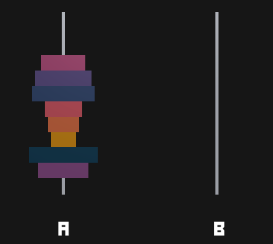

# 42PushSwap  

## About
This project will make you sort data on a stack, with a limited set of instructions, using
the lowest possible number of actions. To succeed you’ll have to manipulate various
types of algorithms and choose the one (of many) most appropriate solution for an
optimized data sorting. </br>

The Push_swap project is a very simple and highly effective algorithm project: data will
need to be sorted. You have at your disposal a set of int values, 2 stacks and a set of
instructions to manipulate both stacks.</br></br>

</br>

## Use:

🚧 project:<br/>
```
42Libft $ make
```

Execute:
```
./push_swap 2 1 3 6 5 8

ARG="2 1 3 6 5 8"; ./push_swap $ARG | wc -l
```

🚿 Clean Obj files:<br/>
```
42Libft $ make clean
```
🚿 🚿 Clean All (obj files + binary):<br/>
```
42Libft $ make fclean
```
🚿 🚿 🚧 Clean All + build:<br/>
```
42Libft $ make re
```
